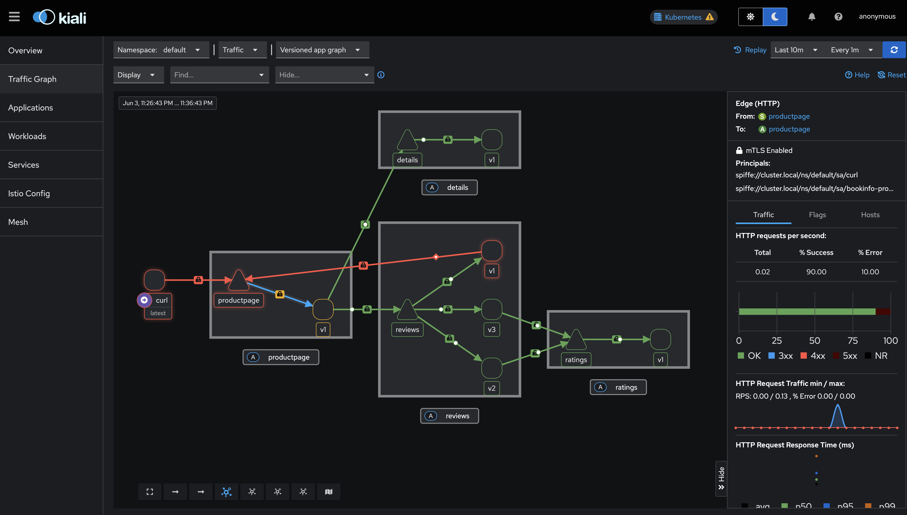

# Ambient Mesh Playground on Azure AKS

## Table of Contents
- [Overview](#overview)
- [Prerequisites](#prerequisites)
- [Project Structure](#project-structure)
- [Usage](#usage)
  - [1. Provision the AKS Cluster](#1-provision-the-aks-cluster)
  - [2. Install Gateway API CRDs](#2-install-gateway-api-crds)
  - [3. Install Istio Ambient Mesh](#3-install-istio-ambient-mesh)
  - [4. Verify Istio Installation](#4-verify-istio-installation)
  - [5. Deploy the Bookinfo Sample Application](#5-deploy-the-bookinfo-sample-application)
  - [6. Onboard Namespace to Ambient Mesh](#6-onboard-namespace-to-ambient-mesh)
  - [7. Enable Observability: Prometheus and Kiali](#7-enable-observability-prometheus-and-kiali)
  - [8. Enable Mutual TLS (mTLS)](#8-enable-mutual-tls-mtls)
  - [9. Apply and Validate Authorization Policies (L4 & L7)](#9-apply-and-validate-authorization-policies-l4--l7)
- [Project Status](#project-status)
- [Next Step](#next-step)
- [References](#references)
- [Cleanup](#cleanup)
  - [1. Clean Up Demo Resources in the Cluster](#1-clean-up-demo-resources-in-the-cluster)
  - [2. Destroy Azure AKS Cluster and Cloud Resources](#2-destroy-azure-aks-cluster-and-cloud-resources)
  - [3. Verify Deletion](#3-verify-deletion)

## Overview
This project provides a hands-on environment for testing and demonstrating Istio Ambient Mesh features and capabilities on Azure Kubernetes Service (AKS). It automates cluster provisioning, verification, and teardown, and is designed for experimentation, learning, and validation of Istio Ambient Mesh in a cloud-native context.

## Prerequisites
- Azure CLI ([Install Guide](https://learn.microsoft.com/en-us/cli/azure/install-azure-cli))
- kubectl ([Install Guide](https://kubernetes.io/docs/tasks/tools/))
- Bash shell (Linux/macOS or WSL on Windows)
- Azure subscription with permissions to create and delete AKS clusters and resource groups

## Project Structure
- `scripts/01_provision_aks_cluster.sh` – Provision and verify an AKS cluster
- `scripts/02_install_gateway_api_crds.sh` – Install Gateway API CRDs
- `scripts/03_install_istio_ambient.sh` – Install Istio Ambient Mesh
- `scripts/04_verify_istio_installation.sh` – Verify Istio installation health
- `scripts/05_deploy_bookinfo_demo.sh` – Deploy the Bookinfo sample application (with optional external access)
- `scripts/06_verify_ambient_onboarding.sh` – Verify namespace onboarding to ambient mesh
- `scripts/07_apply_istio_features.sh` – Enable traffic management, security, and observability for Bookinfo
- `scripts/08_enable_mtls.sh` – Enable STRICT mutual TLS (mTLS) in the `default` namespace
- `scripts/09_apply_authorization_policies.sh` – Apply and validate Istio Authorization Policies (L4 & L7)
- `scripts/PRD.txt` – Product Requirements Document and project plan

## Usage

### 1. Provision the AKS Cluster
```sh
./scripts/01_provision_aks_cluster.sh
```
- This script will create the resource group and AKS cluster (if they do not exist), retrieve credentials, and verify the cluster is ready.

### 2. Install Gateway API CRDs
```sh
./scripts/02_install_gateway_api_crds.sh
```
- Installs the required Gateway API CRDs for Istio Ambient Mesh.

### 3. Install Istio Ambient Mesh
```sh
./scripts/03_install_istio_ambient.sh
```
- Installs Istio with the ambient profile using istioctl.

### 4. Verify Istio Installation
```sh
./scripts/04_verify_istio_installation.sh
```
- Checks that all Istio pods are running and the ztunnel DaemonSet is healthy.

### 5. Deploy the Bookinfo Sample Application
```sh
./scripts/05_deploy_bookinfo_demo.sh
```
- This script deploys the Bookinfo sample application in the `default` namespace.
- It also deploys the Bookinfo Gateway and HTTPRoute resources, following the official Istio Ambient Mesh sample app guide. These resources expose the productpage service via the Gateway API, enabling traffic management and security features.
- Use port-forward to access the app locally:
  ```sh
  kubectl port-forward svc/bookinfo-gateway-istio 8080:80
  # Then open http://localhost:8080/productpage in your browser
  ```

### 6. Onboard Namespace to Ambient Mesh
```sh
kubectl label namespace default istio.io/dataplane-mode=ambient --overwrite
./scripts/06_verify_ambient_onboarding.sh
```

### 7. Enable Observability: Prometheus and Kiali
```sh
./scripts/07_apply_istio_features.sh
```
- This script installs Prometheus and Kiali for observability in your cluster.
- After running the script, access the dashboards with:
  ```sh
  istioctl dashboard kiali
  # Or manually:
  kubectl port-forward svc/kiali -n istio-system 20001:20001
  # Then open http://localhost:20001 (Kiali)
  kubectl port-forward svc/prometheus -n istio-system 9090:9090
  # Then open http://localhost:9090 (Prometheus)
  ```

### 8. Enable Mutual TLS (mTLS)
To enforce secure service-to-service communication in the mesh, enable STRICT mutual TLS (mTLS) in the `default` namespace:

```sh
./scripts/08_enable_mtls.sh
```
- This script applies a PeerAuthentication policy in the `default` namespace to require mTLS for all workloads.
- The script is idempotent and verifies that the policy is applied.

**Verification:**
To confirm mTLS is enforced:
```sh
kubectl get peerauthentication default -n default -o yaml
```
- Look for `mode: STRICT` in the output.
- You can also check the Kiali dashboard for mTLS lock icons between services.

### 9. Apply and Validate Authorization Policies (L4 & L7)
This step demonstrates how to enforce and validate Istio Authorization Policies at both Layer 4 (ztunnel) and Layer 7 (waypoint proxy) for the Bookinfo demo, following the official Istio Ambient Mesh guide.

```sh
./scripts/09_apply_authorization_policies.sh
```
- **What this script does:**
  - Applies a Layer 4 AuthorizationPolicy to restrict access to the `productpage` service to only the Bookinfo gateway service account.
  - Deploys a `curl` pod (if not present) to test access from a different service account.
  - Validates that the curl pod cannot access `productpage` (should fail).
  - Creates a waypoint proxy for the namespace to enable Layer 7 policies.
  - Applies a Layer 7 AuthorizationPolicy to allow only GET requests from the curl service account to `productpage`.
  - Updates the Layer 4 policy to also allow the waypoint proxy.
  - Validates the effects: tests GET and DELETE from curl, and tests access from reviews-v1 (should be denied). Each test generates multiple requests to create visible traffic in Kiali.
- **Expected output:**
  - The script prints clear info messages for each step and validation.
  - Access from unauthorized sources or methods should be denied with an RBAC error, while allowed requests succeed.
  - If any step fails, the script exits with an error message.
- **Reference:**
  - [Istio Ambient Mesh: Enforce Authorization Policies](https://istio.io/latest/docs/ambient/getting-started/enforce-auth-policies/)

**Visualizing Authorization Policy Effects in Kiali**

After running the script, you can observe the generated traffic and policy effects in the Kiali dashboard:



*Example: Kiali graph showing Bookinfo service communication and RBAC policy enforcement. Successful and denied requests are visible as traffic edges and error indicators.*

## Project Status

- [x] Provision AKS cluster
- [x] Install Gateway API CRDs
- [x] Install Istio Ambient Mesh
- [x] Verify Istio installation
- [x] Deploy Bookinfo sample application (local and external access)
- [x] Onboard namespace to ambient mesh (label namespace)
- [x] Enable traffic management, security, and observability features
- [x] Destroy/teardown environment

## Next Step
- **Onboard the default namespace to the ambient mesh:**
  ```bash
  kubectl label namespace default istio.io/dataplane-mode=ambient --overwrite
  ```
  This will enable ambient mesh features for all pods in the default namespace.

## References
- [Istio Ambient Mesh Getting Started](https://istio.io/latest/docs/ambient/getting-started/)
- [Azure AKS Documentation](https://learn.microsoft.com/en-us/azure/aks/)
- [Kubernetes Gateway API](https://gateway-api.sigs.k8s.io/)

## Cleanup

To remove all resources created by this demo, follow these steps:

### 1. Clean Up Demo Resources in the Cluster
This script removes the Bookinfo application, Gateway/HTTPRoute, Istio security policies, Kiali, Prometheus, and any generated YAML files. It leaves the AKS cluster and Istio control plane intact.

```sh
./scripts/09_cleanup_demo_resources.sh
```
- **What it does:**
  - Deletes Bookinfo deployments, services, and related resources in the `default` namespace.
  - Removes Gateway and HTTPRoute resources.
  - Deletes PeerAuthentication and AuthorizationPolicy resources.
  - Removes Kiali and Prometheus addons.
  - Deletes generated YAML files (gateway.yaml, httproute.yaml, peerauth.yaml, authorizationpolicy.yaml).
- **What remains:**
  - The AKS cluster and Istio control plane are still running.

#### Optionally Remove Gateway API CRDs
If you want to remove the Gateway API CRDs from the cluster:
```bash
kubectl delete -f https://github.com/kubernetes-sigs/gateway-api/releases/download/v1.2.1/standard-install.yaml
```
- **Warning:** This will remove Gateway API support from your cluster.

### 2. Destroy Azure AKS Cluster and Cloud Resources
This script deletes the entire AKS cluster and its resource group, including all associated Azure resources. **This action is irreversible.**

```sh
./scripts/10_destroy_aks_cluster.sh
```
- **What it does:**
  - Deletes the AKS cluster.
  - Deletes the resource group and all resources within it (load balancers, public IPs, disks, etc.).
- **Warning:** All cloud resources in the specified resource group will be permanently deleted.

### 3. Verify Deletion
- You can monitor the deletion progress in the Azure Portal or with the Azure CLI:
  ```bash
  az group show --name <your-resource-group>
  ```
  - The resource group will disappear when deletion is complete.

---

By following these steps, you can ensure your Kubernetes cluster and Azure environment are fully cleaned up after running the demo.

For more details, see the [scripts/PRD.txt](scripts/PRD.txt) for the full requirements and roadmap. 